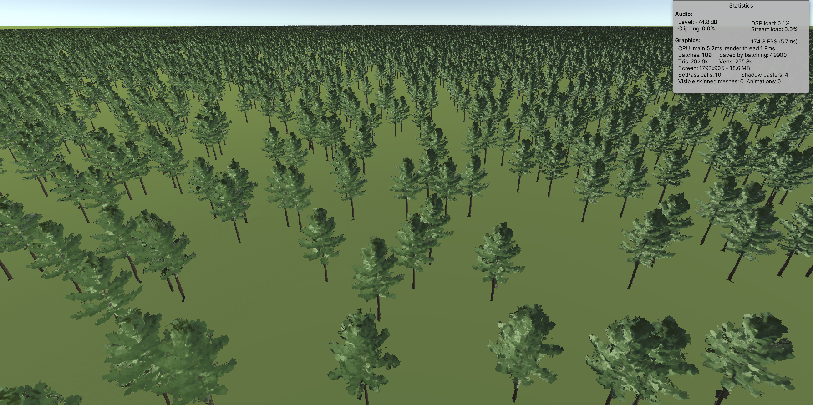

# Imposters Stress Tests

This repository contains stress tests for bilboard imposters available here: https://github.com/xraxra/IMP. Baker scripts are stripped from the project and only rendering part is kept. Basic tree 3D model created using Blender Sappling tool is included for demo purposes.

Performance stress tests show the following framerates for 50,000 trees:

1. Standard instantiate with mesh renderers: 16.7 FPS
2. Calling Graphics.DrawMesh for each tree instance in Update: 10.9 FPS
3. Using Graphics.DrawMeshInstanced: 178 FPS

To run tests, simply enable one of the game objects named "MeshRenderersTest", "DrawMeshTest" or "DrawMeshInstancedTest".

From tests we can see that imposters have their own advantages and limitations.

Maximum performance is not as good as Unity billboards as 178 FPS is for just 50k trees. While billboards as shown in [this repo](https://github.com/chanfort/Tree-billboards-stress-test) are capable of rendering millions of trees. Still it's much better than using regular meshes. It can be also noticed that imposters require instancing support and older graphics cards may have issues while Unity's tree billboards are running nicely since early days of Unity. Imposters also do not support casting shadows and would need to write additional shadow pass in ImposterStandard.shader.

On a good side, trees are aligning nicely to perspective camera. They also react nicely to directional light. The side of trees looking into the direction of sun appears brighter than the opposite side. And trees can have randomized rotations.
